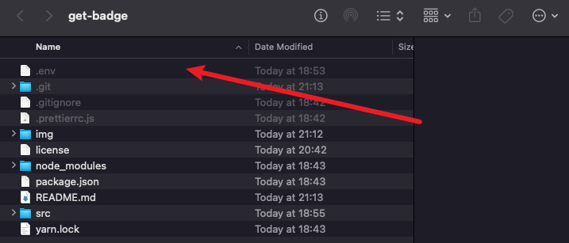
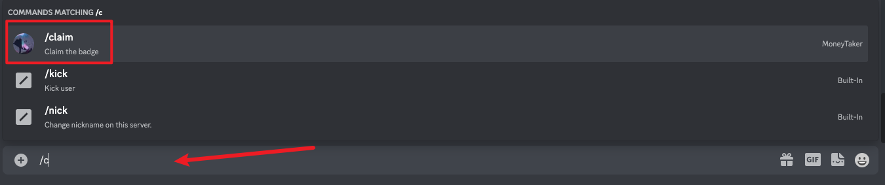

# Claim Discord Developer Badge
> This is a open source repo for people who can not coding  
> Or Too lazy to code that lol
# Step By Step

## Step0 - Downlaod codebase
- Clone it 
- Download the zip and unzip it
- Change directory to your code base location
## Step1 - Install dependency
- [Node.js](https://nodejs.org/en/)
- [Yarn](https://yarnpkg.com/getting-started/install)
> Open cmd or any terminal enter command below  
```bash
npm i -g yarn
```
## Step2 - Install code dependency

> Open cmd or any terminal enter command below
```bash
yarn  
# or  
yarn install
```

## Step3 - Create your own discord bot
- [Discord Developer Portal](https://discord.com/developers/applications)
1. New Application
2. Enter the Name
3. Copy the APPLICATION ID to code base `.env` (if the file does not exist, create a new one) 

4. `.env` content should look like below
```
TOKEN=<Token>
CLIENTID=<APPLICATION ID>
GUILDID=<DISCORD SERVER ID>
```
1. On the left-hand sidebar click the `Bot` tab
2. Add Bot
3. Reset Token
4. Copy the Token to code base `.env` (if the file does not exist, create a new one)
5. On the left-hand sidebar click `OAuth2` tab > `URL Generator` tab
6.  Click `Bot` and `applications.commands` checkbox in the `scope` area
7.  Click the `Administrator` checkbox in the `Bot Permissions` area
8.  Copy the link and paste it to the browser URL and hit the enter
9.  Create a discord server and set it to a community server
10. Invite Bot to Server
## Step4 - Register Command
> Open cmd or any terminal enter command below  
> Please make sure paste the discord server id to `.env` file
```bash
yarn deploy
```
## Step5 - Run Bot
> Open cmd or any terminal enter command below
```bash
yarn dev
```

## Step6 - Claim 
1. Go to the discord server and create a text channel
2. Typing `/claim` on the discord message area then press the enter

3. The bot should return a message to you. (if it's not please open a ticket)
4. After 24h, Click the link that the bot gave you
5. Claim!

# QA
> If you got any issue or error, please open a ticket on github  
> Please make sure you cleary discribe the issue

Peace out:3